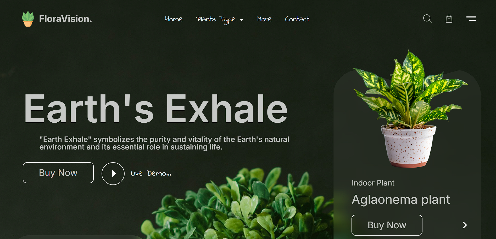
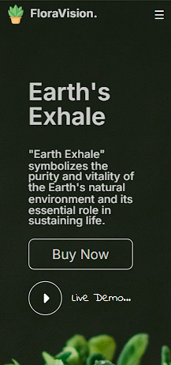

# 🌿 **FloraVision – Plant E-commerce Website**

> A beautifully crafted and fully responsive **Plant E-commerce Website** built using **React.js**, offering a modern design and smooth shopping experience across all devices.

---

## 🚀 **Live Demo**
**Live URL:** [https://plant-ecommerce-react-one.vercel.app/](https://plant-ecommerce-react-one.vercel.app/)  

---

## 📸 **Preview**

| Desktop View | Mobile View |
|---------------|--------------|
|  |  |

---

## ✨ **Features**

🌿 **Responsive Design** — Perfectly optimized for all screen sizes  
🎨 **Modern UI/UX** — Clean, intuitive, and aesthetic interface  
📱 **Mobile-First** — Prioritizes mobile usability  
🛒 **Product Catalog** — Explore a wide variety of plants  
⭐ **Customer Reviews** — Real feedback to build trust  
📧 **Newsletter Subscription** — Stay updated with latest offers  
⚡ **Fast Performance** — Lightweight React components ensure quick loading  

---

## 🛠️ **Tech Stack**

### **Frontend**
- React.js 18.2.0  
- CSS Modules  
- React Icons
- Tailwind CSS

## 📱 **Responsive Breakpoints**
**The website is optimized for all screen sizes:**
- Desktop: 1200px and above
- Tablet: 768px - 1199px
- Mobile: 480px - 767px
- Small Mobile: Below 480px

### **Development**
- Create React App Using Vite 
- Git & GitHub  
- npm / yarn  

### **Deployment**
- Vercel
  ```bash
  npm run build
  npm install -g vercel
  vercel

- Continuous Deployment

---

## 📦 **Installation Guide**

### **Prerequisites**
- Node.js (v14 or higher)  
- npm or yarn  
- Git  

### **Setup Steps**

```bash
# 1️⃣ Clone the repository
git clone https://github.com/AslamKhanpathan142/plant-ecommerce-react.git
cd plant-ecommerce-react

# 2️⃣ Install dependencies
npm install
npm react icons
# or
yarn install

# 3️⃣ Start development server
npm start
# or
yarn start
```
---
## 🏗️ **Project Structure**

```text
plant-ecommerce-react/
├── public/
│ ├── index.html
│ └── favicon.ico
├── src/
│ ├── components/
│ │ ├── Navbar.js
│ │ ├── HeroSection.js
│ │ ├── ProductSection.js
│ │ ├── IndoorPlantCard.js
│ │ ├── DeskDecorations.js
│ │ ├── OurBest.js
│ │ ├── CustomerReview.js
│ │ ├── RonnieTestimonial.js
│ │ ├── TopSellingPlants.js
│ │ ├── Footer.js
│ │ └── Button.js
│ ├── styles/
│ │ ├── App.css
│ │ ├── Navbar.module.css
│ │ ├── HeroSection.module.css
│ │ ├── ProductSection.module.css
│ │ ├── IndoorPlantCard.module.css
│ │ ├── DeskDecorations.module.css
│ │ ├── OurBest.module.css
│ │ ├── CustomerReview.module.css
│ │ ├── RonnieTestimonial.module.css
│ │ └── Footer.module.css
│ ├── assets/
│ │ ├── logo.png
│ │ ├── backgroundImage.jpg
│ │ ├── desk1.png, desk2.png
│ │ ├── flower.png, flower2.png
│ │ ├── feedback1.png, feedback2.png
│ │ └── search.png, bag.png, arrow.png
│ ├── App.js
│ └── index.js
├── package.json
└── README.md

```
---
## 🧩 **Available Components**
| Component              | Description                              |
| ---------------------- | ---------------------------------------- |
| `Navbar.js`            | Top navigation bar with logo and icons   |
| `HeroSection.js`       | Introductory banner with main visuals    |
| `ProductSection.js`    | Section displaying plant collections     |
| `IndoorPlantCard.js`   | Reusable card for plant items            |
| `DeskDecorations.js`   | Decorative plant displays                |
| `OurBest.js`           | Highlights best plant collections        |
| `CustomerReview.js`    | Shows customer feedback                  |
| `RonnieTestimonial.js` | Specific testimonial section             |
| `TopSellingPlants.js`  | Displays most popular plants             |
| `Footer.js`            | Page footer with contact and social info |
| `Button.js`            | Reusable button component                |

---
## 🖋️ Fonts Used

This project uses the following Google Fonts:

```html
<link href="https://fonts.googleapis.com/css2?family=Indie+Flower&family=Inter:wght@400;500;600;700&display=swap" rel="stylesheet">
```

---

## 👨‍💻 Author

**MO Aslam Khan**  
📧 **Email:** [khanaslampathan142@gmail.com](mailto:khanaslampathan142@gmail.com)  
🌐 **GitHub:** [https://github.com/AslamKhanpathan142/](https://github.com/AslamKhanpathan142)  
💼 **Portfolio:** [your-portfolio-link.com](https://portfolio-vert-six-50.vercel.app/)

---

> Built with ❤️ by Mo Aslam Khan using React.js

